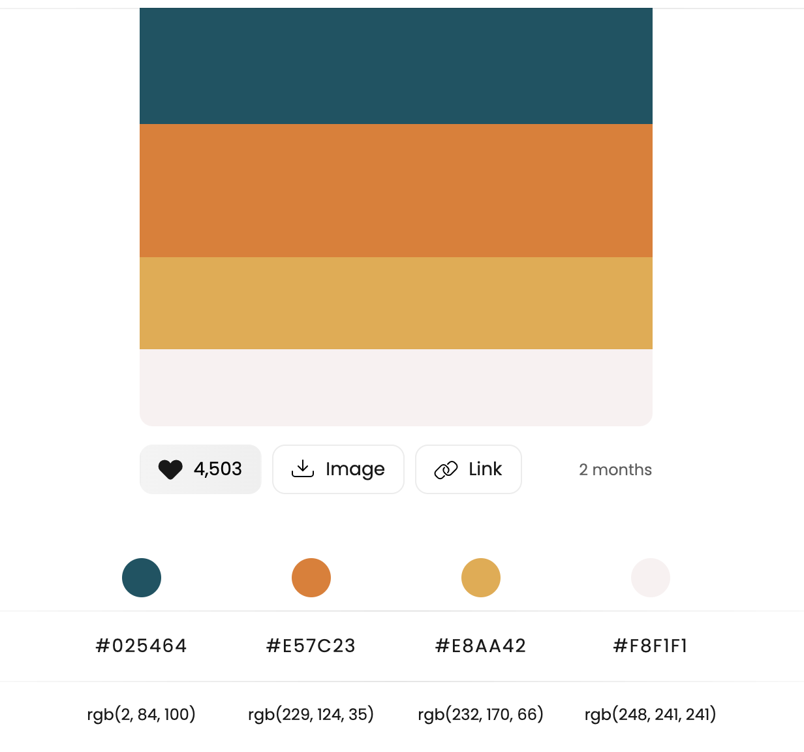
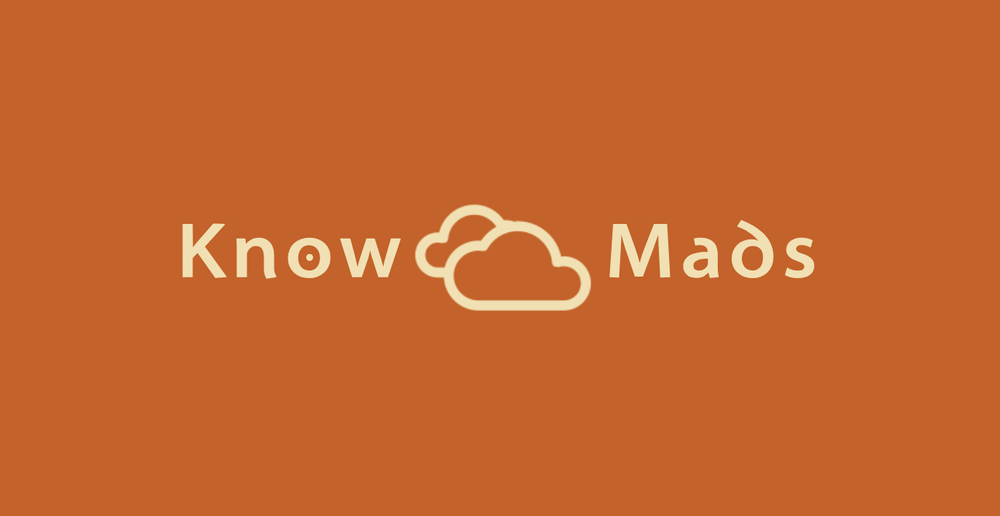
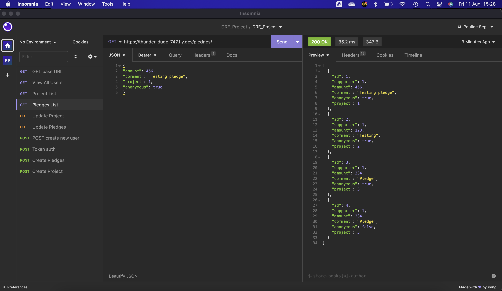
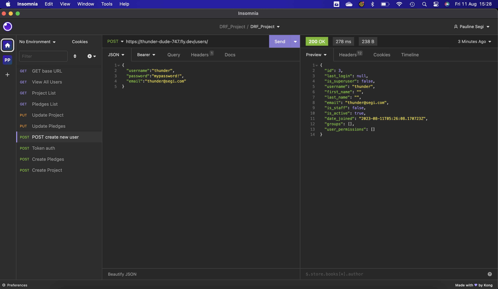
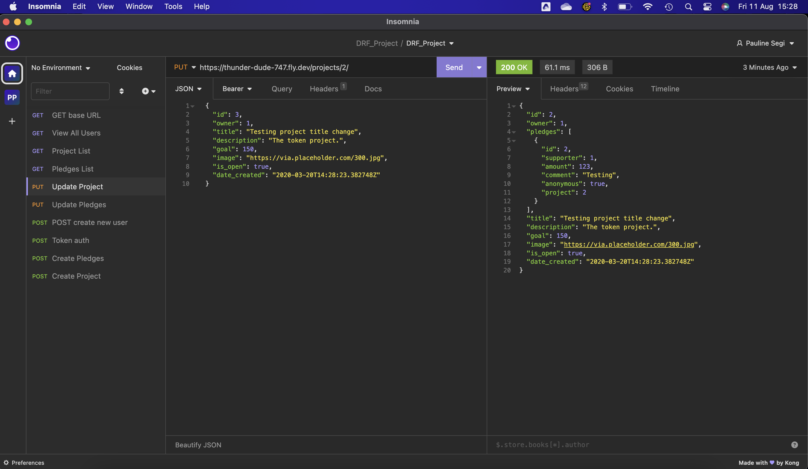
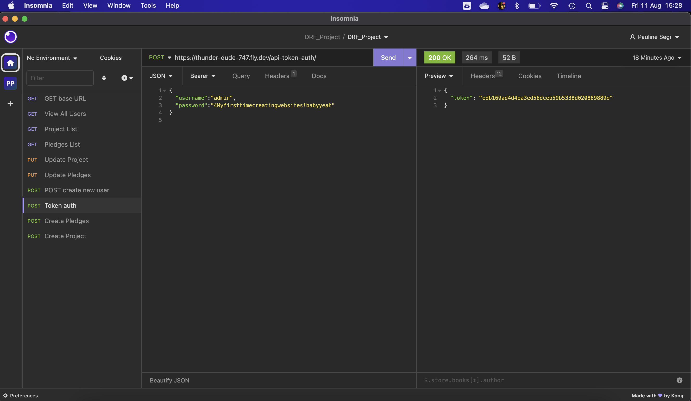

# KnowMads
by {{ Pauline Segi }}
She Codes crowdfunding project - DRF Backend.

## About
{{ A paragraph detailing the purpose and target audience for your website. }}

{{ 
KnowMads
their destination, fuelled by your donation.

My project is called KnowMads (a play on words for Grey Nomads - the common term for retirees who are off adventuring across the country in their caravans and mobile homes).

A crowdfunding website where Grey Nomads (or retirees in general) can post projects on what they would like to do, like buy a new camper, or go across the country, or get a knee operation, etc., and people can fund them. 

Target audience would be mainly their family members and friends, but it's also targeted at Gen X'ers, and potentially Millenials. 

Persons who have a bit of extra cash, a bit more settled in life, and who have parents who are retired now and want them to enjoy their life and retirement. 

}}

## Features
{{ The features your MVP will include. (Remember this is a working document, you can change these as you go!) }}
* [x] User can create an account (one account can be associated with both Owner and/or Supporter)
* [x] User can login/logout of account (Username / Email / Password)
* [] User can add a profile picture
* [] User can add a bio
* [x] User can create a project
* [x] User can pledge to a project
* [x] User can delete a project (only the Owner of the project can delete the project)
* [] User can search projects

### Stretch Goals
{{ Outline three features that will be your stretch goals if you finish your MVP }}

* [] Users can share the project to social media (as either Owner or Supporter)
* [] Users can see a donation progress bar
* [] Owner can respond to comments from Supporters (thanking them etc.) 

## API Specification

| HTTP Method | Url | Purpose | Request Body | Successful Response Code | Authentication   Authorization
| --- | ------- | ------ | ---- | -----| ----|
| GET | projects/ | Return all projects | N/A | 200 | N/A |
| POST | projects/ | Create a new project | project object | 201 | User must be logged in. |

'''this is all the endpoints (the urls) to get there on our website. so a user can create a project, so we'll add a url here to see what that would look like. This includes the error codes. refer to the Example REST API Specification for details on what I might need, maybe I'll need different ones, maybe I won't need all of them etc.'''

## Database Schema
{{ Insert your database schema }}

## Wireframes
{{ Insert your wireframes }}

## Colour Scheme
{{ Insert your colour scheme }}

D15C10 Orange
F4E0AE Yellow
025464 Dark Teal
F8F1F1 Pale Grey

Cloud logo: https://app.brandmark.io/nounpreview/670146.png

## Fonts
{{ outline your heading & body font(s) }}

Logo Font - Santana
Heading Font - Brandmark Sans 11 Color Shadow
Body Font - Brandmark Sans 2

## Submission Documentation
{{ Fill this section out for submission }}

Deployed Project: [This is my deployed site, and what will eventually become the backend of KnowMads](https://thunder-dude-747.fly.dev/projects/)

### How To Run
{{ What steps to take to run this code }}

### Updated Database Schema
{{ Updated schema }}

### Updated Wireframes
{{  Updated wireframes }}

### How To Register a New User
{{ Step by step instructions for how to register a new user and create a new project (i.e. endpoints and body data). }}

### Screenshots
* [] A screenshot of Insomnia, demonstrating a successful GET method for any endpoint.

* [] A screenshot of Insomnia, demonstrating a successful POST method for any endpoint.

* [] A screenshot of Insomnia, demonstrating a successful PUT method for any endpoint.

* [] A screenshot of Insomnia, demonstrating a token being returned.
